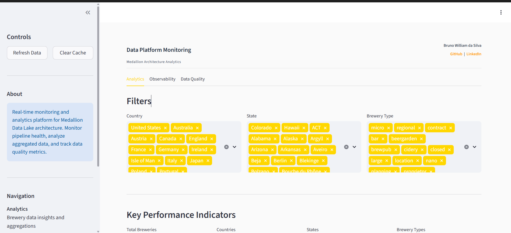
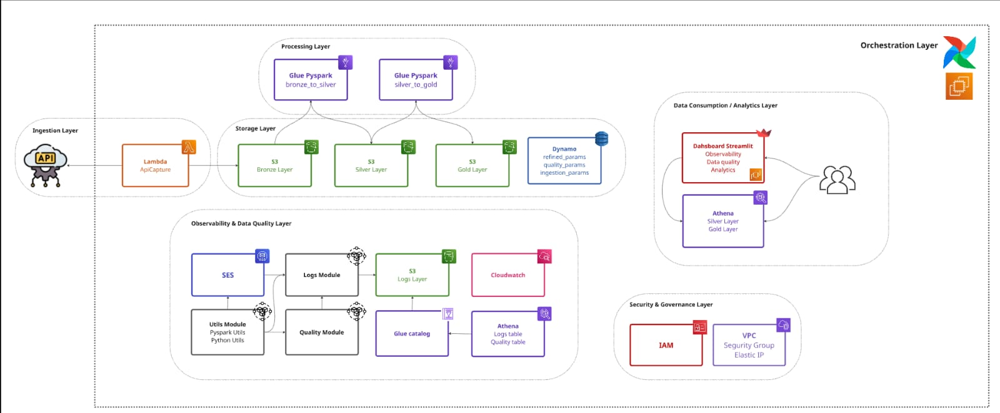

# Brewery Data Lake on AWS


A production-grade data lake that ingests brewery data from the [Open Brewery DB API](https://openbrewerydb.org/), transforms it through a three-tier Medallion Architecture, and serves analytics via a Streamlit dashboard. Built on AWS with modularized logging, automated data quality testing, and email notifications for pipeline failures.

## Live Dashboard

**Access the dashboard:** http://56.124.50.116:8501/



Interactive analytics with three main sections:

- **Analytics** – Browse brewery data, apply filters, and view interactive graphs showing trends and distributions
- **Observability** – Real-time logs showing successful pipeline runs, errors, and performance metrics with visual charts
- **Data Quality** – Data validation results, completeness scores, and anomalies detected during processing

Watch demo videos to see the dashboard in action:

- [Analytics Dashboard Demo](docs/videos/01-analytics-dashboard-demo.mp4) (3 min)
- [Observability Logs Demo](docs/videos/02-observability-logs-demo.mp4) (2.2 min)
- [Data Quality Demo](docs/videos/03-data-quality-demo.mp4) (1.8 min)

For detailed dashboard documentation, see [Streamlit Guide](docs/dashboard.md).

## Architecture Overview



[View full architecture with diagrams and detailed explanations](docs/architecture.md)

For an interactive architecture diagram, see the [live Miro board](https://miro.com/app/live-embed/uXjVG24Xf7s=/?focusWidget=3458764662592067466&embedMode=view_only_without_ui&embedId=571479114836).

## How It Works

Daily at 7:00 AM UTC, the Airflow DAG triggers the following automated workflow:

1. **Ingestion** – AWS Lambda calls the Open Brewery DB API, handles pagination, and stores raw JSON in S3 Bronze
2. **Bronze Layer** – Raw data preserved as-is for disaster recovery and reprocessing
3. **Silver Layer** – AWS Glue applies PySpark transformations: clean column names, handle nulls, remove duplicates, partition by location, store as [Parquet](https://parquet.apache.org/) for efficient columnar storage
4. **Gold Layer** – AWS Glue creates pre-aggregated analytics: count of breweries by type and location, stored in [Apache Iceberg](https://iceberg.apache.org/) format for ACID transactions
5. **Execution Logging** – Each component (Lambda, Glue jobs) writes structured execution logs to a centralized Athena table `execution_logs`, partitioned by execution date, with step-level timing
6. **Data Quality** – Automated validation tests for completeness, accuracy, and consistency across all layers; quality results stored in Athena
7. **Email Alerts** – Configurable email notifications on failures and warnings, managed via DynamoDB `notification_params` table
8. **Monitoring** – [AWS CloudWatch](https://docs.aws.amazon.com/cloudwatch/) captures infrastructure metrics and logs; dashboard displays pipeline health in real-time

## Cloud Setup

All components run on AWS infrastructure with zero local setup required.

A dedicated read-only user was created for you to safely explore the data lake. Access it with the credentials below – no need to install any software or configure anything locally.

```
AWS Console: https://580148408154.signin.aws.amazon.com/console
User: datalake-reader
Password: [Provided in secure channel]
```

With read-only access, you can:
- Browse S3 Bronze, Silver, Gold, and Logs layers
- Query Athena tables: Gold layer analytics, execution logs, data quality results
- Explore table schemas in AWS Glue Catalog
- View pipeline execution records and audit trails

## Technology Stack

| Component | Technology |
|-----------|------------|
| **Cloud** | [AWS Lambda](https://docs.aws.amazon.com/lambda/), [Glue](https://docs.aws.amazon.com/glue/), [Athena](https://docs.aws.amazon.com/athena/), [S3](https://docs.aws.amazon.com/s3/), [DynamoDB](https://docs.aws.amazon.com/dynamodb/), [SNS](https://docs.aws.amazon.com/sns/), [SES](https://docs.aws.amazon.com/ses/), IAM, EC2 |
| **Orchestration** | Apache Airflow |
| **Processing** | Python, PySpark |
| **Dashboard** | Streamlit |
| **Storage** | [Parquet](https://parquet.apache.org/), [Apache Iceberg](https://iceberg.apache.org/) |
| **Logging** | AWS CloudWatch, S3, Athena |

## Key Features

**Modularized Logging** – All components (Lambda, Glue jobs) use a [centralized Logs class](aws/modules/logs.py) that writes structured execution records with step-level timing to an Athena table. Each log includes job name, status, warnings, errors, and custom metadata.

**Centralized Execution Logs** – A single Athena table `execution_logs` aggregates logs from all pipeline components, partitioned by execution date for efficient querying and auditing. See [logs implementation](aws/modules/logs.py).

**Data Quality Framework** – Automated validation tests check data completeness, accuracy, and consistency at each layer. Quality metrics are stored in Athena for historical analysis and trend detection. See [quality module](aws/modules/quality.py).

**Email Alerting** – Configurable email notifications using [AWS SES](https://docs.aws.amazon.com/ses/) for pipeline failures and warnings. Alert recipients and thresholds are managed in DynamoDB.

**Automated Retry Logic** – Failed Lambda and Glue jobs automatically retry with exponential backoff, reducing transient failures.

**Optimized Storage** – Silver and Gold layers use partitioning by location for query performance. Gold layer uses [Apache Iceberg](https://iceberg.apache.org/) for ACID transactions and schema evolution.

**DynamoDB Configuration** – Pipeline parameters, notification settings, and job configurations stored in DynamoDB tables for easy management without code changes.

## Documentation

- [Architecture](docs/architecture.md) – Design patterns, data flow, security model
- [Airflow Orchestration](docs/airflow.md) – DAG structure, dependencies, scheduling
- [AWS Setup](docs/aws_setup.md) – Services, IAM policies, configuration
- [Dashboard Guide](docs/dashboard.md) – Using Streamlit analytics
- [Monitoring & Alerting](docs/monitoring.md) – CloudWatch metrics, health checks, incident response

## Code Organization

- [Lambda Scripts](aws/lambda_scripts/) – API ingestion and S3 cleanup
- [Glue ETL Jobs](aws/glue_scripts/) – Bronze→Silver→Gold transformations
- [Shared Modules](aws/modules/) – Centralized Logs class, AWS utilities, PySpark helpers, data quality functions
- [Airflow DAG](dags/brewery_pipeline.py) – Pipeline orchestration
- [Streamlit Dashboard](streamlit_app/) – Analytics interface

## Infrastructure & Security

**Serverless Design** – [Lambda](https://docs.aws.amazon.com/lambda/), [Glue](https://docs.aws.amazon.com/glue/), and [Athena](https://docs.aws.amazon.com/athena/) scale automatically with zero infrastructure management. Pay only for what you use.

**EC2 Services** – Streamlit dashboard and Apache Airflow run on dedicated EC2 instances for 24/7 availability.

**Security Controls** – Read-only IAM user provided for safe exploration. All S3 data encrypted at rest using [AWS KMS](https://docs.aws.amazon.com/kms/). No credentials hardcoded in repositories; all credentials loaded from EC2 IAM roles or [AWS Secrets Manager](https://docs.aws.amazon.com/secretsmanager/).

**Audit Logging** – [CloudWatch](https://docs.aws.amazon.com/cloudwatch/) captures all API calls and data access for compliance and troubleshooting.

See [AWS Setup Guide](docs/aws_setup.md) for detailed security configuration and IAM policies.

---

## Questions or Feedback?

Thanks for reading! If you have any questions about the pipeline or would like to discuss the architecture, feel free to reach out.

**Contact:**
- Email: brun0ws@outlook.com
- LinkedIn: https://www.linkedin.com/in/brunowds/
- WhatsApp: https://wa.me/5515997595138
