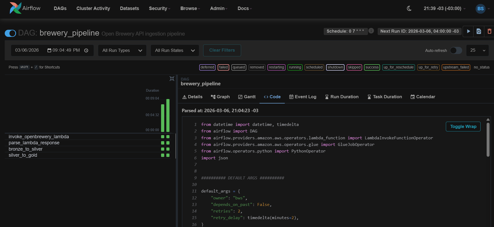
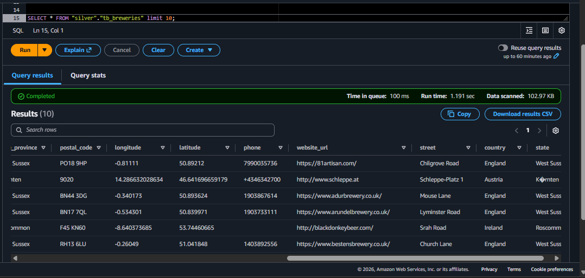
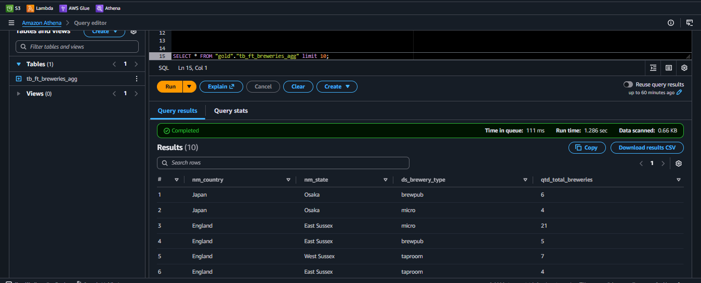
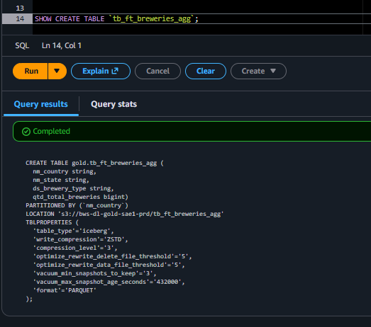
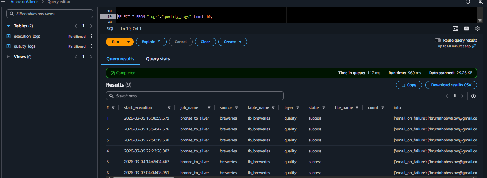
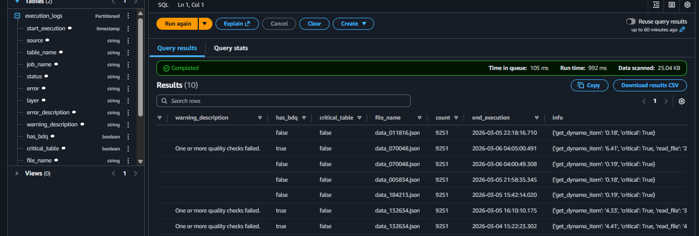
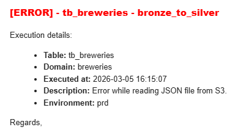
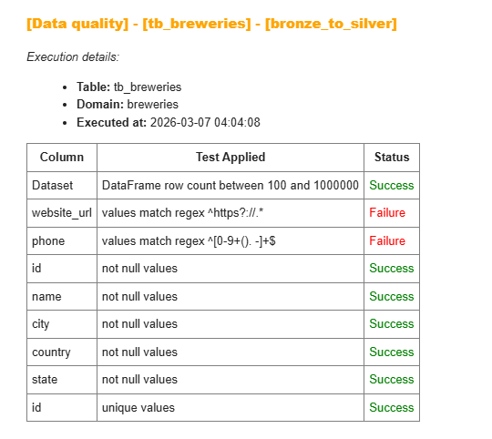
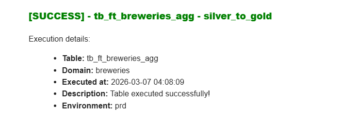

# Architecture

This document walks through the full data pipeline — from raw API ingestion to analytics-ready tables — covering each component, how they connect, and the design decisions behind it.

## Architecture Diagram

For an interactive view, open the [Miro board](https://miro.com/app/live-embed/uXjVG24Xf7s=/?focusWidget=3458764662592067466&embedMode=view_only_without_ui&embedId=571479114836).


---

## Orchestration — Airflow

[Apache Airflow](https://airflow.apache.org/) is the central orchestrator for the entire pipeline. It runs inside a **Docker container** on an [EC2](https://docs.aws.amazon.com/ec2/latest/userguide/concepts.html) instance, which keeps the runtime environment consistent and portable without needing to install dependencies directly on the host. The EC2 instance uses a fixed [Elastic IP](https://docs.aws.amazon.com/AWSEC2/latest/UserGuide/elastic-ip-addresses-eip.html), so the address never changes between restarts.

The Airflow web UI is accessible on port **8080**, kept private via the EC2 security group — only authorized access is allowed. The Streamlit dashboard shares the same EC2 instance and Elastic IP, exposed on port **8501** to the public.

The DAG `brewery_pipeline` runs daily at **7:00 AM UTC**, firing each step in sequence and passing outputs between tasks through [XCom](https://airflow.apache.org/docs/apache-airflow/stable/core-concepts/xcoms.html).

**Version:** Apache Airflow 2.10.3  
**Providers:** [apache-airflow-providers-amazon](https://airflow.apache.org/docs/apache-airflow-providers-amazon/stable/index.html) 8.26.0

The pipeline has four tasks:

```
invoke_openbrewery_lambda → parse_lambda_response → bronze_to_silver → silver_to_gold
```

The first task fires the Lambda function. The second parses the Lambda response and pulls out two values — `filename` and `ingestion_date` — which get injected as job arguments into the two downstream Glue steps.



DAG file: [dags/brewery_pipeline.py](../dags/brewery_pipeline.py)

---

## Ingestion — AWS Lambda

The [Lambda](https://docs.aws.amazon.com/lambda/latest/dg/welcome.html) function `BronzeApiCaptureBreweries` pulls a full snapshot from the [Open Brewery DB API](https://openbrewerydb.org/documentation). Before paginating, it calls the `/meta` endpoint to get the total record count and calculate exactly how many pages are needed (up to 200 records per request). All records are collected, serialized as JSON, and uploaded to S3 in a single file.

**Target bucket:** `bws-dl-bronze-sae-prd`

**S3 path pattern:**
```
breweries/tb_breweries/ingestion_date=YYYY-MM-DD/data_HHMMSS.json
```

After the upload completes, the function returns `filename` and `ingestion_date` to Airflow. Those values travel through XCom into the parameters of the next Glue jobs.

**Retry logic:** On HTTP errors or timeouts, each request retries up to 3 times with exponential backoff before raising an exception.

**Notifications** are configured via the `notification_params` table in [DynamoDB](https://docs.aws.amazon.com/amazondynamodb/latest/developerguide/Introduction.html). This table controls which email addresses receive alerts on failure, warning, or success.

> [!NOTE]
> For DynamoDB parameter details, see [dynamo_params.md](dynamo_params.md). For shared module documentation, see [modules.md](modules.md).

Script: [aws/lambda_scripts/BronzeApiCaptureBreweries.py](../aws/lambda_scripts/BronzeApiCaptureBreweries.py)

---

## Bronze Layer — Raw Data

The Bronze S3 bucket stores raw JSON files exactly as returned by the API — no transformations applied. This layer is the safety net of the pipeline: if anything goes wrong downstream, data can always be reprocessed from here without hitting the API again.

---

## Bronze to Silver — AWS Glue (PySpark)

The [Glue](https://docs.aws.amazon.com/glue/latest/dg/what-is-glue.html) job `bronze_to_silver` reads the JSON file from the Bronze layer and converts it into [Parquet](https://parquet.apache.org/) format. Parquet is a columnar storage format that reduces query costs and execution time on Athena significantly compared to JSON — particularly when filtering on specific columns.

Data is written to the Silver bucket partitioned by **country** and **state**, so location-based queries only scan the relevant partitions instead of the full dataset.

**What this job does:**
- Reads the exact file passed by Airflow (`--file_name` and `--dt_ref`)
- Applies schema casting, null handling, and column standardization
- Runs data quality checks configured in DynamoDB (`quality_params`) using the Quality module
- Writes the clean result as Parquet, partitioned by country and state

**Designed as a generic processing engine:**
This job reads all its configuration from DynamoDB (`ingestion_params`) — source paths, schema definitions, quality rules. Pass it different parameters and it processes a completely different dataset without any code changes. This makes it reusable across multiple ingestion pipelines.



> [!NOTE]
> For DynamoDB parameter details, see [dynamo_params.md](dynamo_params.md). For shared module documentation, see [modules.md](modules.md).

Script: [aws/glue_scripts/bronze_to_silver.py](../aws/glue_scripts/bronze_to_silver.py)

---

## Silver to Gold — AWS Glue (PySpark)

The [Glue](https://docs.aws.amazon.com/glue/latest/dg/what-is-glue.html) job `silver_to_gold` reads clean Silver data and produces a pre-aggregated table in the Gold layer. Instead of hardcoding the transformation logic inside the job, the SQL query is stored as a `.sql` file in S3 and loaded at runtime. This keeps business logic versioned and separated from execution code.

The job runs that SQL against the Glue/Iceberg catalog inside a Spark environment and writes results to an [Apache Iceberg](https://iceberg.apache.org/) table. Iceberg is an open table format built for data lakes — it brings ACID transactions, schema evolution, and time-travel queries on top of S3, making the Gold layer safe to overwrite and consistent to query from Athena. More on [why Iceberg here](https://iceberg.apache.org/docs/latest/).

**What the SQL does:**
Groups breweries by country, state, and brewery type, counting how many exist per combination. This powers the main analytics view in the Streamlit dashboard.

SQL file: [aws/sql/gold/tb_ft_breweries_agg.sql](../aws/sql/gold/tb_ft_breweries_agg.sql)

**Column naming conventions:**
The Gold table follows a structured naming convention to make the schema self-explanatory and governance-friendly. Column prefixes communicate the nature of each field at a glance:
- `nm_` — name or descriptive label (e.g. `nm_country`, `nm_state`, `ds_brewery_type`)
- `qtd_` — quantity or count (e.g. `qtd_total_breweries`)

This is a deliberate practice carried through the table creation DDL, which also includes proper Iceberg table properties — setting the correct format version, table optimization configurations, and Athena-compatible metadata parameters so both engines read the table without issues.





**Also a generic engine:**
Like the Bronze to Silver job, configuration is pulled from DynamoDB (`refined_params`). Point it at a different SQL file and target table and it processes an entirely different aggregation without touching the code.

> [!NOTE]
> For DynamoDB parameter details, see [dynamo_params.md](dynamo_params.md). For shared module documentation, see [modules.md](modules.md).

Script: [aws/glue_scripts/silver_to_gold.py](../aws/glue_scripts/silver_to_gold.py)

---

## Dashboard — Streamlit

After the Gold layer is ready, the data is immediately available for the Streamlit dashboard. The application runs in a **Docker container** on the same EC2 instance as Airflow, using the same Elastic IP — accessible on port **8501** and open to the public.

The dashboard has three main sections: analytics with filters and charts, pipeline observability, and data quality results.


> [!NOTE]
> For full dashboard documentation, see [dashboard.md](dashboard.md).

---

## Security

Access control is handled through [AWS IAM](https://docs.aws.amazon.com/iam/latest/userguide/introduction.html) roles and policies, following the principle of least privilege. Each service (Lambda, Glue, EC2) has its own IAM role with only the permissions it actually needs.

The EC2 instance sits inside a [VPC](https://docs.aws.amazon.com/vpc/latest/userguide/what-is-amazon-vpc.html) with a [security group](https://docs.aws.amazon.com/vpc/latest/userguide/vpc-security-groups.html) that controls which ports and IPs can reach it. Port 8080 (Airflow) is private; port 8501 (Streamlit) is public. A fixed [Elastic IP](https://docs.aws.amazon.com/AWSEC2/latest/UserGuide/elastic-ip-addresses-eip.html) ensures the instance address stays stable. All S3 data is encrypted at rest and DynamoDB tables use AWS KMS.

---

## Observability — Logs & Data Quality

Every component in the pipeline — Lambda and both Glue jobs — uses a centralized `Logs` module to write structured execution records to a dedicated Athena table (`execution_logs`), partitioned by execution date. Each record includes the job name, target table, layer, execution status, step-level timing, and any warnings or errors captured during the run.

Data quality validations are handled by the `Quality` module, built on top of [Great Expectations](https://docs.greatexpectations.io/). It runs configurable checks — null rates, uniqueness, regex patterns, range validations — and writes the results to a separate `data_quality_logs` table in Athena. On failure or warning, it sends an email notification via SES and can optionally halt the job.

This custom observability approach is the primary way to monitor the pipeline. CloudWatch is also active and captures infrastructure-level metrics for Lambda invocations and Glue job runs, but the execution and quality logs in Athena give far more context for debugging and auditing.





When a job fails or a quality check doesn't pass, an email is dispatched via [AWS SES](https://docs.aws.amazon.com/ses/latest/dg/Welcome.html) to the addresses configured in the `notification_params` DynamoDB table.







> [!NOTE]
> For full logging and quality module documentation, see [modules.md](modules.md).